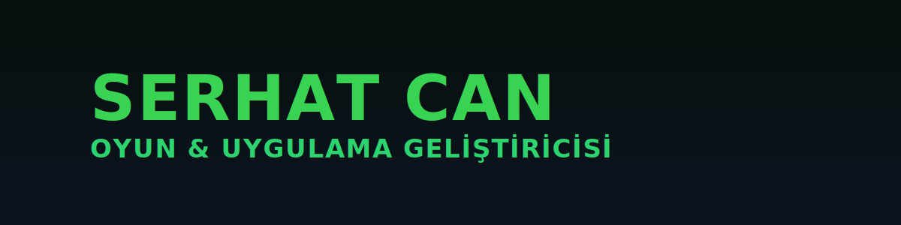

<!-- Banner -->

  

---

# 👋 Merhaba, ben Serhat Can (ByDolor)

🚀 **Oyun & Uygulama Geliştiricisi**  
🎨 **UI/UX Tasarımcısı**  
🎵 **Müzisyen**

💡 Yenilikçi mobil uygulamalar ve oyunlar geliştiriyorum.  
🎯 Hedefim: kullanıcı dostu ve eğlenceli deneyimler yaratmak.

---

## 🛠️ Tech Stack

  
  
  
  
  

---

## 📊 GitHub İstatistiklerim

 
 

---

  

---

##  Sosyal Bağlantılarım

  
  

